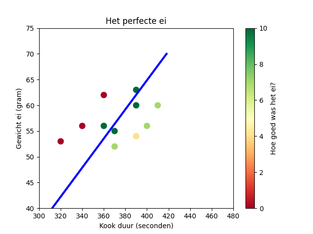

# The Perfect Soggy Egg
### **How to get the perfect egg with the eggyolk soggy and eggwhite sturdy?**

Solution:
- Buy a bunch of eggs
- Weigh them 
- Boil them at various durations 
- Rate each egg:
   - perfect = 10 = eggwhite hard but entire eggyolk soggy. 
   - Good = 7 = eggwhite hard but eggyolk partly also hard 
   - OK = 4 = eggwhite hard but most of eggyolk hard 
   - No = 0 = eggwhite still soggy or eggyolk entirely hard
- Plot the results and fit a function 
    - Install requirements for python3
    - `python perfect_egg.py`

## Result 

## measurement methodology
- Put a pan with lightly boiling water on some fire 
- Put a hole in the egg 
- Lower the egg in the water and start the timer
- When the timer is done, directly move the egg to a pan with cold water 

